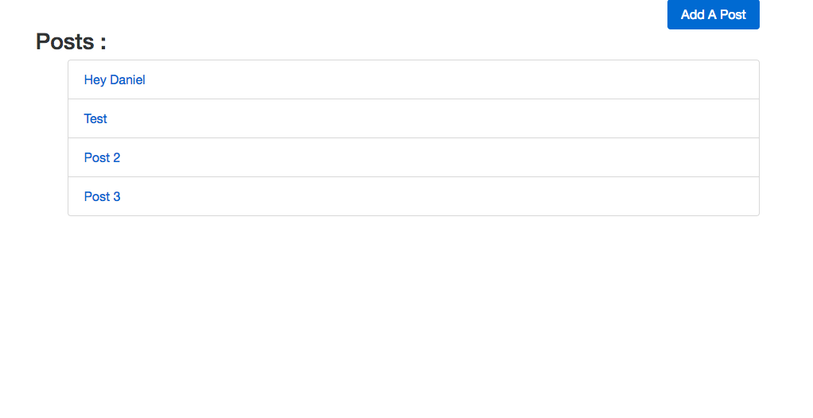
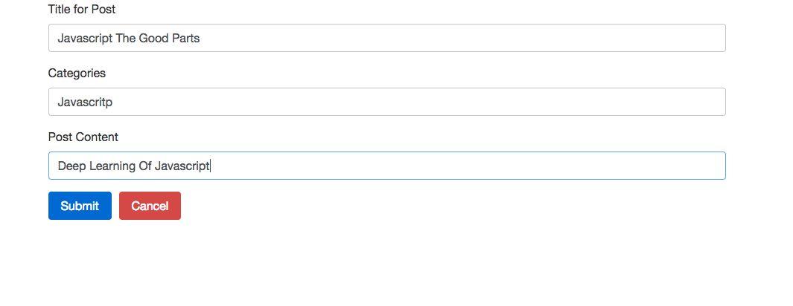
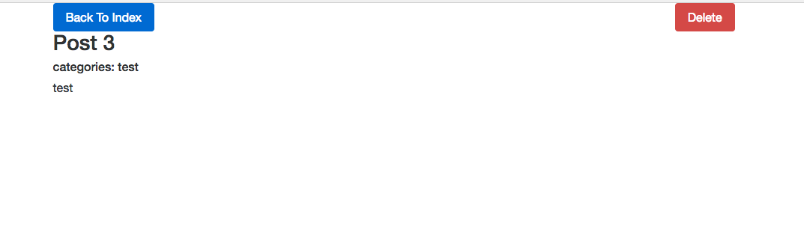

# Redux Blog

### Getting Started

There are two methods for getting started with this repo.

#### Familiar with Git?
Checkout this repo, install dependencies, then start the gulp process with the following:

```
> git clone https://github.com/danielemanuel/redux_blog
> cd ReduxSimpleStarter
> npm install
> npm start
```

#### Not Familiar with Git?
Click [here](https://github.com/danielemanuel/redux_blog) then download the .zip file.  Extract the contents of the zip file, then open your terminal, change to the project directory, and:

```
> npm install
> npm start
```


#### App description:

- The app is build using React and Redux
- I am fetching the data from Redux Blog API (http://reduxblog.herokuapp.com/)
- User can create a new post, view the post details and delete the post
- React Router is implemented for navigation between the routes
- Redux Form implemented for adding a new post
- lodash library is imported

- User can see all the posts(fetching the data) :

  

- User can add new post(post data):

  

- User can view the details for one specific post and delete it(delete the data):

  
